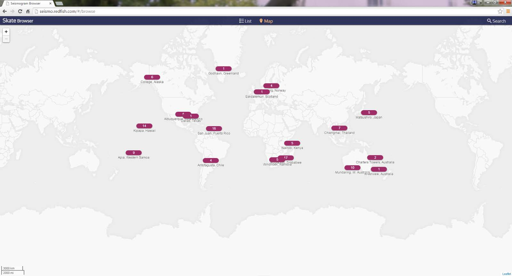

## Browsing and Viewing
Once a search is complete, a thumbnail list of found seismograms will be displayed. The default
*List* display is active and will display 20 thumbnails per page. Scrolling down will continue to
pull up more thumbnails. Alternatively, clicking on the *Map* icon will display a world map with
location and counts by station of the searched for
seismograms.

To view seismograms from a particular station, click on the location. The available
seismograms will display in the *List* view.
Once the seismogram of interest is located, click on the thumbnail to display the image.
Navigating the image is done as follows.

### Zooming in and out

Using the scroll wheel on a mouse zooms in and out on the displayed image. Also, the “+/”
button on the screen allows zooming.
Absent a scroll wheel, the <= > keyboard key zooms in. The <->
keyboard key zooms out. If
the *Seismogram Data* or *Seismogram Actions* menus have been used, it might be necessary
to first place the mouse over the image and click once in order for the keyboard zoom function
to become active.

*Panning*. Left click and hold while dragging the mouse. When zoomed in, the up/down,
left/right arrows on the keyboard also should allow panning.

### Saving Images

Any full resolution .png image that is available on the UI can be downloaded. Open the desired
image and click on *Download Original.* Please limit the number of downloads to only those
necessary.

