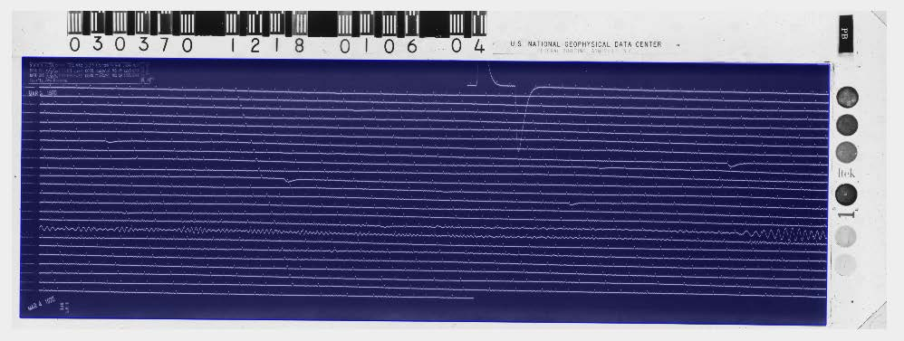

## Definitions

Terms used in this manual are defined here.

<u>meanlines</u>. This is the zeroenergy
line that a trace would follow if there was no seismic
activity. Meanlines are the imagewide
line segments that we calculate for this zeroenergy
path, and which are used for subsequent trace assignment and connection algorithms.

<u>trace</u>. In a WWSSN image, this is the image path that the incident light beam records on the
recording drum’s photographic paper. It is the seismic data from which we extract timeseries
data.

<u>segments</u>. A seismogram image file consists of foreground and background. Foreground
features are the traces themselves. Our task is to identify and separate them from the
background. Background includes all non trace features such as noise, and additional features
such as hand written notes, etc. Because of timing marks, trace crossings, and the multiple
hourly lines found in a WWSSN seismogram, the traces are broken up into pieces. We call
these pieces of a seismic trace a segment.

<u>centerlines</u>. Centerlines represent the actual path that a trace is following. It is a single pixel
wide object that tracks the middle of a segment.
ROI. The ROI is the Region of Interest in the seismogram. It is the portion of the image that
contains the actual seismic traces. In the image below, the ROI is shaded in light blue.

<u>scanning</u>. Seismograms that are scanned are simple image files, usually .tif or .png.

<u>digitize</u>. Digitizing a seismogram takes the scanned image file and extracts the time series that
represents the seismic trace’s amplitude as a function of time. We output the time series as
either a .json file or a .csv. Other formats such as mSEED will be created in future versions.

<u>S3</u>. Amazon S3 (Simple Storage Service) is an online file storage web service offered by
Amazon Web Services. Amazon S3 provides storage through <a href="https://en.wikipedia.org/wiki/Amazon_S3">web services interfaces</a> (REST ,
SOAP , and BitTorrent). Retriever Technology stores all of its scanned seismograms on S3. I n
addition, the UI is hosted on S3. Monthly costs accrue for this service.