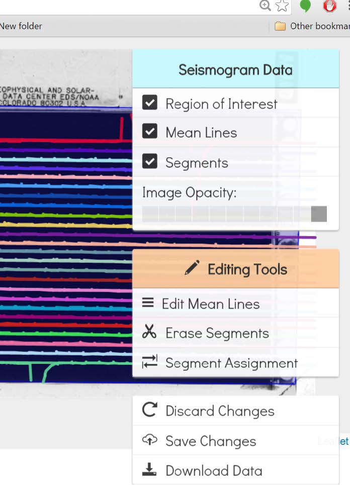

## Editing
Editing can be done both before and after segment assignment. To switch to editing mode,
click on either of the links shown by red arrows below.


Once in Editor mode, the following screen with menu items becomes available.

<div style="width:50%; margin: auto;">



</div>

```{toctree}
---
maxdepth: 2
---
tools.md
segment.md
saving.md
download.md


