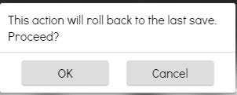
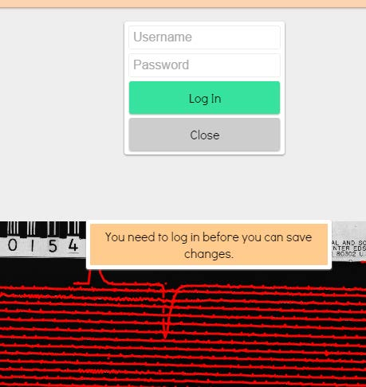
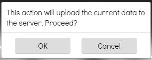

### Saving or discarding changes. Downloading data.

 Important note on saving changes.
 SKATE is currently set up to store the raw data on S3; it
will not be changed by any editing. However, changes to edited data <strong><em>will</em></strong> be permanently
changed on S3; therefore the user needs to be very careful to make only those changes that are
correct and necessary. As currently configured, the philosophy behind editing and saving is
that multiple users can correct and improve any given seismogram; it is the availability of input
from the broader seismic community that allows for the best result to be ultimately obtained. In
addition, each save requires a transfer of data to S3, which incurs data transfer costs. Because
there is a very limited operational budget, please limit your saving activities. Note: Only users
with login credentials are able to save changes to S3.

#### Discard Changes
At any time any changes made can be discarded. This will revert the data back to the
last saved value. Select *Discard Change* and the following menu will appear:

#### Save Changes
To save the changes, click on *Save Changes* and the following menu will appear:

If you have login information, enter it now in order to proceed. Once logged in, the
following menu item will appear:

Select *OK*. This uploads the data to the S3 server.
