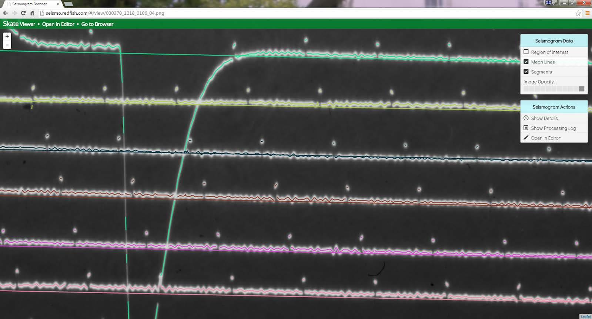
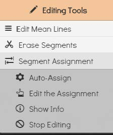
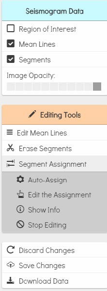
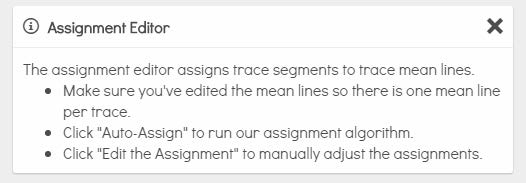
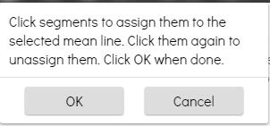
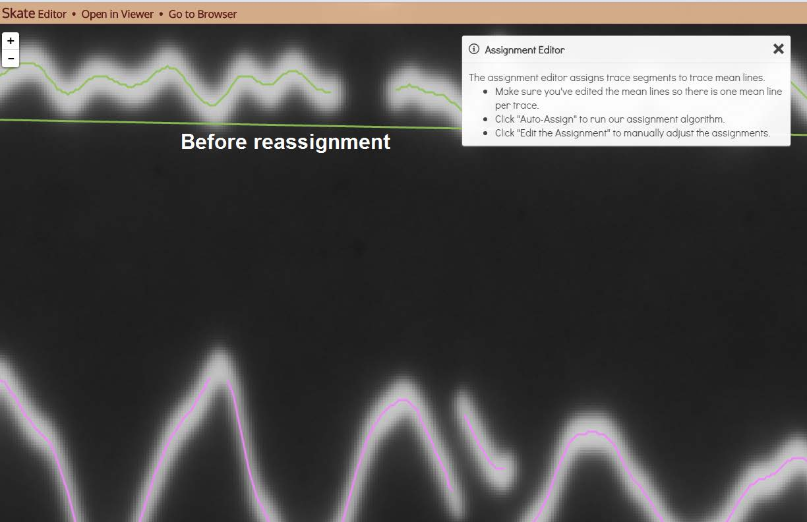
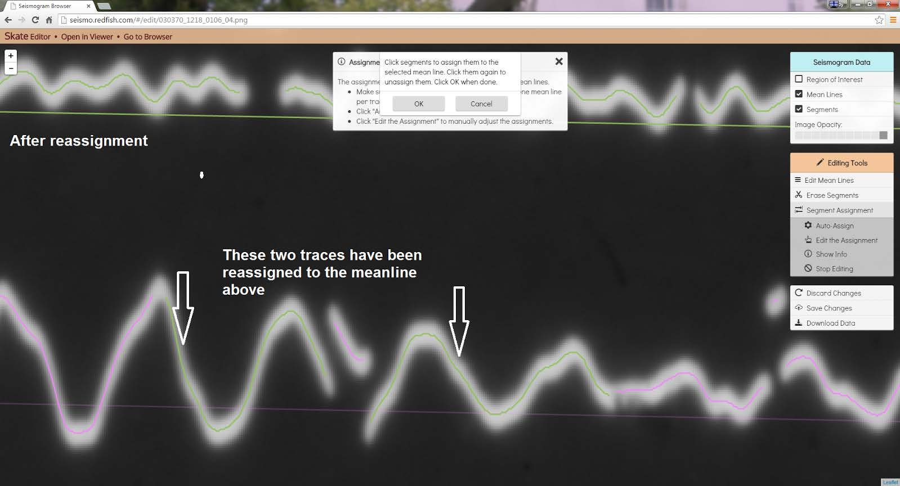

### Segment Assignment
Once editing is complete, the Segment Assignment algorithm can be run by clicking on
*Segment Assignment*. The algorithm uses the meanlines as a fundamental organizing
feature. Therefore, after running the assignment algorithm, the segments will be colored
according to the meanline with which they are associated, as shown in the image below.

To run the assignment algorithm, click on *Segment Assignment* and then *AutoAssign*.
While the time to run the algorithm varies, expect it to take 12
minutes. Do not click any other
buttons while waiting for the auto assignment to complete.

#### Editing Segment Assignment
Once the segment assignment algorithm has been run, the image can be inspected for
accuracy, and edited again. Click on *Segment Assignment* and the following menu will appear:

And clicking on *Show Info* will pull up the explanatory menu:

As the menu explains, it is important that one meanline is present and drawn to
reasonable accuracy for each hour or partial hour of the seismogram[^5]. This step should have
already been performed during previous editing.

[^5]:Noting that we are currently only processing later date WWSSN long period seismograms, in which the
length of a single line corresponds to one hour of recording time. Refer to the WWSSN Users Guide
previously referenced for more information on seismogram characteristics.

To change the assignment of a segment to a meanline, click on *Edit the Assignment*.
The following menu appears:

Click on the meanline to which you which to assign a misassigned segment, then click
*OK*.

A new menu will appear.

Next, click on the segment to be reassigned, then click *OK*. More than one segment
can be selected; continue to click on segments that will be reassigned. They will change color
to match the meanline to which they will be reassigned as demonstrated in the image below
(noting that the image shows an improper assignment, but nevertheless is shown here for
instructional purposes). When selection is completed, click *OK*.

When reassigning is complete, the data can be saved or discarded. Also, the segment
assignment algorithm can be run again in case the reassignment of segments changes the
assignment of other segments. At this time we do not recommend running the assignment
algorithm after editing the assignment.

