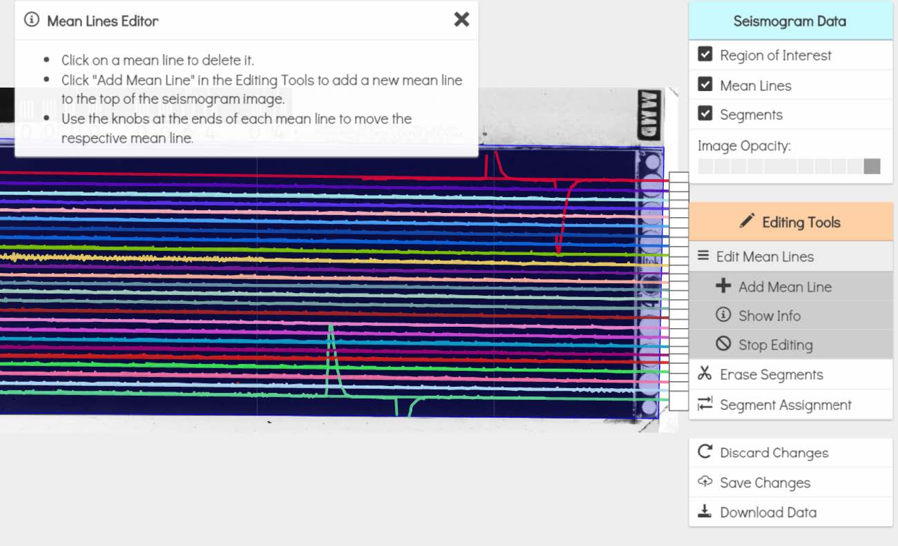
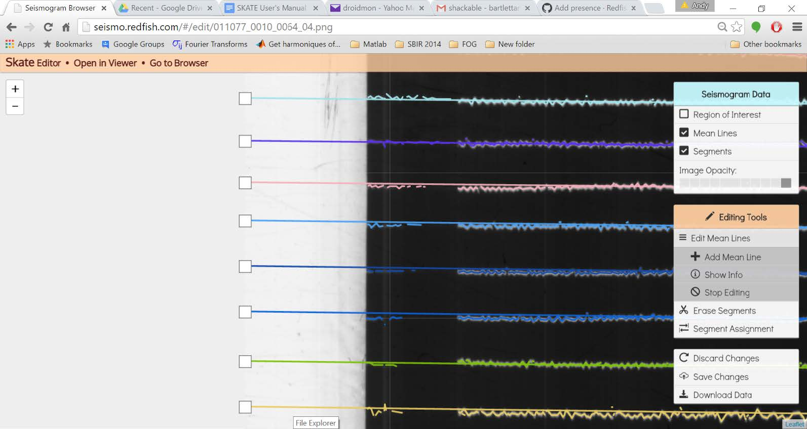
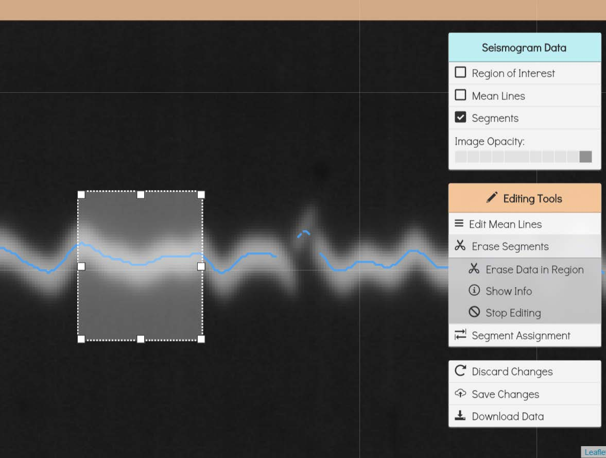

### Editing Tools

<a href="#edit_meanlines">Edit Meanlines</a> 
  <a href="#moving_a_meanline" style="margin-left: 20px;">Moving a Meanline</a> 
  <a href="#deleting_a_meanline" style="margin-left: 20px;">Deleting a Meanline</a> 
  <a href="#adding-a-meanline" style="margin-left: 20px;">Adding a Meanline</a> 
<a href="#erase-segments">Erase Segments</a> 

#### Edit Meanlines

Clicking on *Edit Mean Lines* pulls up the following menus. It might be necessary to
click on *Show Info* in order to view the *Mean Lines Editor* menu box:

Meanlines are the zero-energy
line of the seismogram, and are used for Segment
Assignment. However, they are not used as data normalization lines, so it is not critical to
exactly align them to the zero-energy
line[^3]. Images that are listed as *Has Raw Data* are those
in which meanlines have been automatically calculated. The algorithm is not 100% accurate, so
the user should add, delete, or move meanlines in order to cover all lines and partial lines with a
meanline.

[^3]:Image distortions such as lens distortions, scanning errors, paper shrinkage, etc., make a linear fit to a
zero-energy
line less than exact. The issue of zero-energy
line fit will be handled in future iterations
when manipulating the trace information in data space, as opposed to image space.

##### Moving a meanline

Meanlines have handles on the end of them, and extend beyond the ROI and out to the
edge of the entire image in order to make it easy to visualize and manipulate. Zooming in while
in the meanline editor looks like this:

Note that the meanlines in this example are not perfectly aligned with the zero-energy
line, but represent positioning that is sufficiently close for subsequent segment assignment.

To reposition a meanline, click on the handle and drag the mouse to the desired position.
Repeat for any line that needs to be repositioned. Changing one meanline does not change
any others.

##### Deleting a meanline

To delete a meanline, click anywhere on the meanline besides its handle. A dialog box
will appear:

Select *OK* or *Cancel* as appropriate.

##### Adding a meanline

To add a meanline, click on *Add Mean Line*. The new meanline will appear at the top
of the image. (Zooming out might be required to see the new meanline.) Multiple meanlines
can be added. Note that clicking on *Add Mean Line* multiple times will overlay the new
meanlines on top of one another. Each needs to be dragged out of the way in order to view the
new meanline that is below it. Place meanlines where desired using the procedure to move
meanlines described above.

#### Erase Segments
Images that are listed as *Has Raw Data* are those in which segments and centerlines
have been automatically calculated. As it is with meanlines, the algorithm to calculate segments
and centerlines is not 100% accurate, and typically errs by identifying noise and other
superfluous features as segments. The editor allows the user to selectively delete these
features[^4].

[^4]:At this time there is no way to add segments and centerlines. Future improvements will likely allow this
feature to be performed in data space rather than image space.

To get into the segment editor, click on *Erase Segments*. The following menu items
appear. Clicking on *Show Info* will pull up the *Segment Erasure Tool* info box.

Once *Erase Segments* is clicked, an 8-handled
rectangle selection tool will appear, as
shown below. Zoom and pan as required to locate those segments to be deleted. Click and
drag in the middle of the selection tool to move it around. Click and drag the selection tool’s
handles to adjust its size. When the segment to be deleted is enclosed by the selection
rectangle, click *Erase Data in Region*. The images below show before and after segment
deletion.

 

