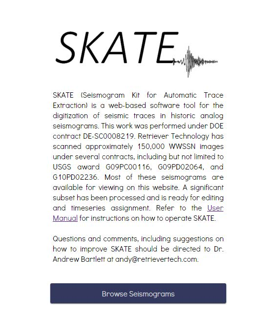
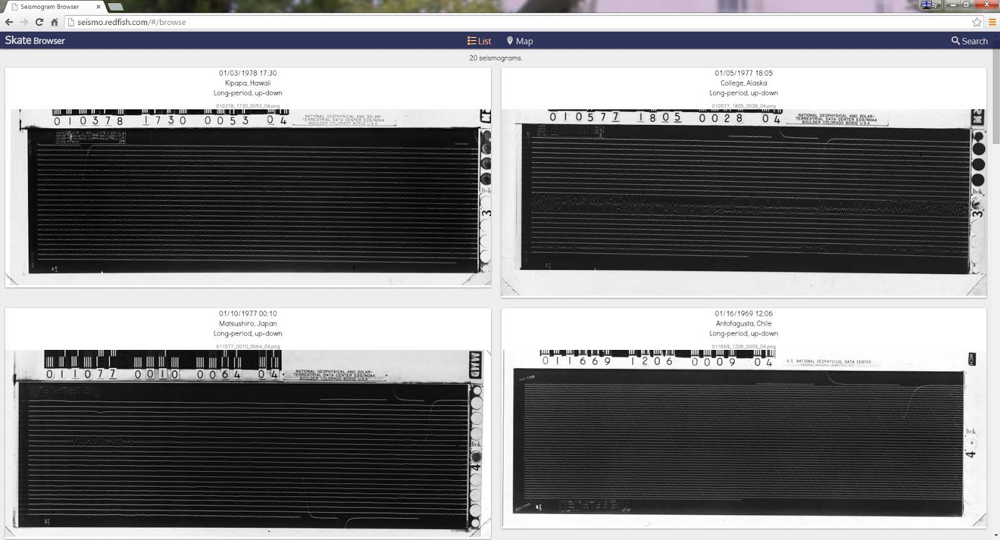

## Login

Login requirements have changed from earlier releases. Now, there is no login requirements for
browsing, editing and downloading timeseries data. The only time a login is required is when
saving data; because this permanently alters the metadata on S3 we are limiting this
functionality to approved users. Refer to the section on saving data for login instructions.

To begin using SKATE,,navigate to <a href="seismo.redfish.com"> seismo.redfish.com</a>. The following welcome page appears.

Click on ‘ Browse Seismograms .’

At this point a thumbnail list of seismograms will likely be displayed:

