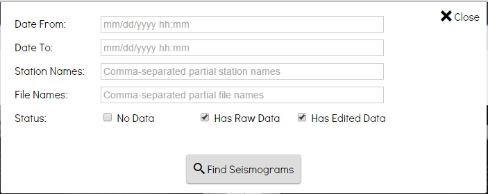

## Searching

To search for a particular seismogram, click on the “ Search ” link. The following menu item will
appear.

<em>Dates</em>. The Search window allows specific dates and times to be searched. A complete date
can be entered. Alternatively, the four digit year can be inputted in the *Date From* and *Date
To* fields. Searching by only putting in a month or a day or a time will not work.

*Station names*. This allows for searching of one or more stations by name. Type in the three
character station name, or a portion of the name, or the name or portion of the actual location
(i.e., city and country name). Multiple stations can be searched by separating station names by a
comma. Do not search by station number, as this option is not available. Quotes and wildcard
operators do not work.
Station names and other WWSSN information can be found in the <a href="http://pubs.usgs.gov/of/2014/1218/pdf/ofr20141218.pdf"> WWSSN User’s Guide</a>.

*No Data*. Searching can include/be limited to seismograms with *No Data*. This indicates a
seismogram that is accessible from the UI but has not been processed in any way. There are
currently 154,658 of these seismogram which represent Retriever Technology’s database on S3.
Users may search and view these images, but due to cost constraints tied to Amazon’s data
download fees and EC2 operational fees, these are not available for download or processing.
Contact Retriever Technology if there is a particular seismogram of interest.

*Has Raw Data*. Searching can include/be limited to seismograms with *Raw Data.* This
indicates seismograms that have been processed up to the point where they have: ROI,
meanline, segment and centerline information. They do not have segment assignment
information. There are currently over 11,000 of these file, with more being processed on 40
EC2 instances. There will be approximately 50,000 available shortly.

*Has Edited Data*. Searching can include/be limited to seismograms with *Has Edited Data.*
These seismograms have the same information as in *Has Raw Data*, and in addition have
been edited to improve meanlines and remove spurious segments as necessary, and then have
been run through the assignment editor. Segment assignment means that segments are
sequentially attached to previous and subsequent segments. In other words, the seismogram
has been solved.

This is a small subset of images that have been handedited
by summer interns at
Retriever Technology. They are likely very good, though not perfect, in their editing.